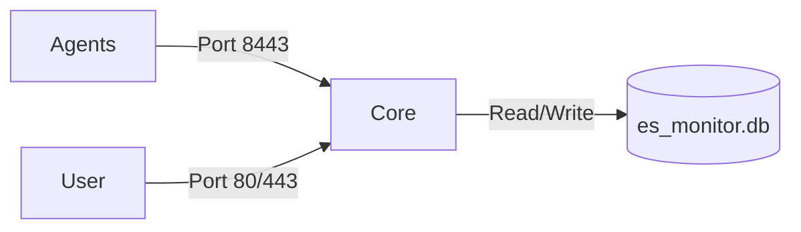
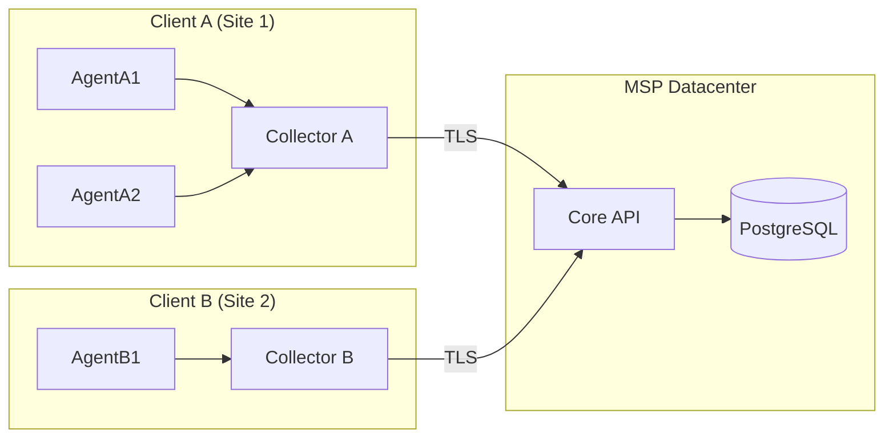
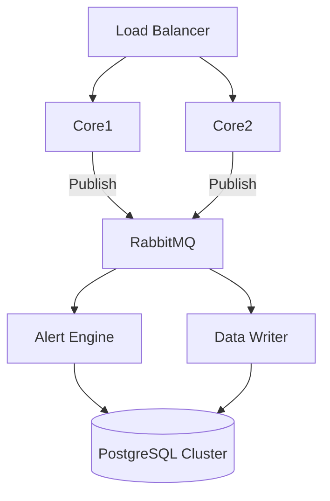

# Enterprise Scaling Strategy

The eSolutions Monitoring Platform is designed to scale from a single server (MVP) to a globally distributed enterprise deployment. This document outlines the architectural tiers and scaling strategies.

## Tier 1: MVP / Single Site
**Best for**: POCs, Small environments (< 50 Servers), Development.

In this model, all "Core" components run on a single server.
*   **eSolutions Core**: 1 Node (API + Alert Engine).
*   **Database**: SQLite (local file) or Single PostgreSQL instance.
*   **Dashboard**: Served directly by the Core.

## Tier 2: Distributed (Multi-Client / MSP)
**Best for**: Managed Service Providers (MSPs), Multi-Site Organizations.

This model separates the "Ingestion" from the "Processing" and introduces **Collectors** to bridge network zones.

*   **Collectors**: Placed in remote customer networks (behind firewalls). They buffer data and push to the Core.
*   **Core**: Centralized in the MSP Datacenter.
*   **Database**: PostgreSQL 15 (Dedicated Server).

## Tier 3: Enterprise (High Availability)
**Best for**: Large Enterprises (> 1000 Servers), Critical Infrastructure.

This model eliminates Single Points of Failure (SPOF) and handles high ingestion rates.

*   **Load Balancer**: NGINX / HAProxy distributing traffic.
*   **Core Cluster**: Multiple stateless Core instances behind the LB.
*   **Message Queue**: RabbitMQ buffers incoming metrics for asynchronous processing.
*   **Database**: PostgreSQL Cluster (Patroni/stolon) + TimescaleDB.

## Capacity Planning

| Tier | Metric/Sec | Storage (1 Yr) | CPU | RAM |
| :--- | :--- | :--- | :--- | :--- |
| **Tier 1 (MVP)** | < 100 | ~50 GB | 2 vCPU | 4 GB |
| **Tier 2 (SME)** | 100 - 1,000 | ~500 GB | 4 vCPU | 8 GB |
| **Tier 3 (Ent)** | > 1,000 | > 2 TB | 8+ vCPU | 16+ GB |

## Handling Multi-Tenancy (Multi-Client)
For MSPs monitoring multiple distinct clients:

1.  **Network Isolation**: Use **Collectors** as gateways. No direct connection from Agent to Core required.
2.  **Data Segregation**: 
    *   Add `tenant_id` tag to every metric at the Collector level.
    *   Row-Level Security (RLS) in PostgreSQL ensures Client A cannot query Client B's data.
3.  **Authentication**: Issue unique API Tokens per Collector.
